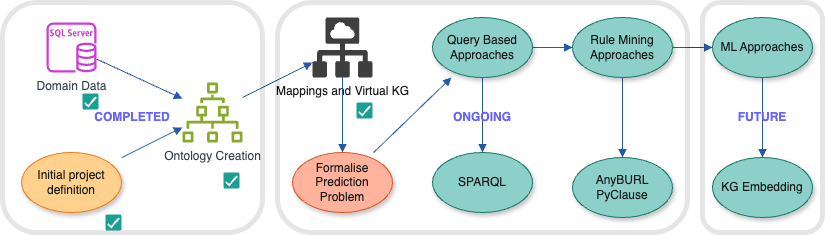
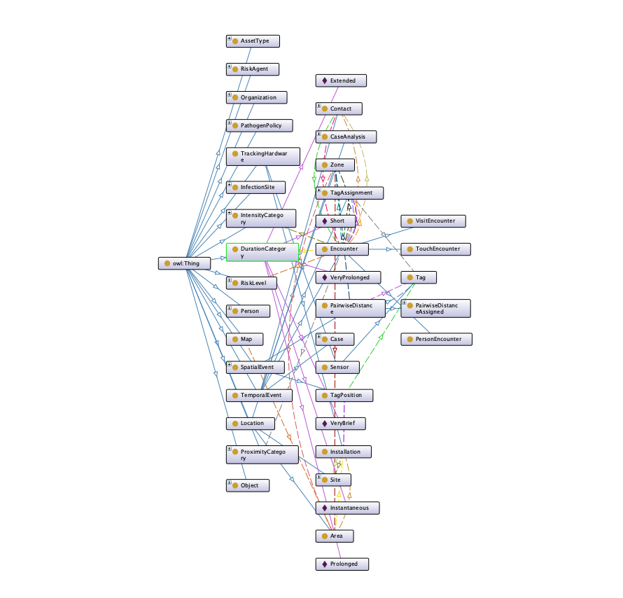

# Knowledge representation for infection transmission risk prediction

This repository contains the intial pipeline for building an OWL Ontology / Knowledge Graph from a real-time data location system (RTLS) SQL Dataset. Ontop ODBA mappings and SPARQL rules are used to generate categorical proximity, duration and intensity ranges for encounter events to provide inputs for downstream rule mining and Machine Learning.

The main components

# Ontology: OWL QL/RL Protégé compatible ontology

-	An extensible, reusable OWL ontology describing the database schema to support the development of ML risk modelling.

# Mappings: Ontop mappings, ODBA and R2RML transfer SQL logic to RDF triple generation

-	ODBA / R2RML Mappings enabling SPARQL queries to be translated into SQL queries to the database.

-	Definition of cascaded rules to determine if a contact or encounter occurs.
-	Defined profiles for categories of proximity, duration and intensity that indicate safety or risk.
-	Determine the limitations of rules structures to inform what is needed to identify a positive encounter.

