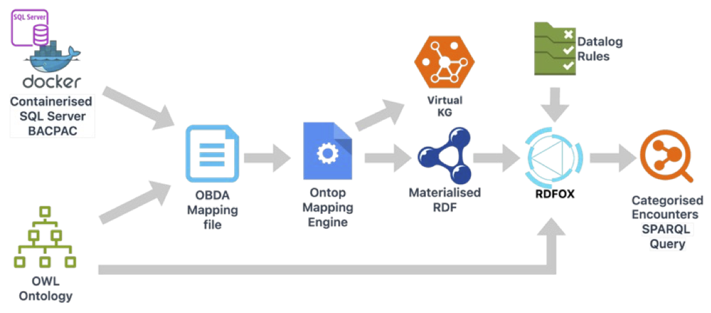
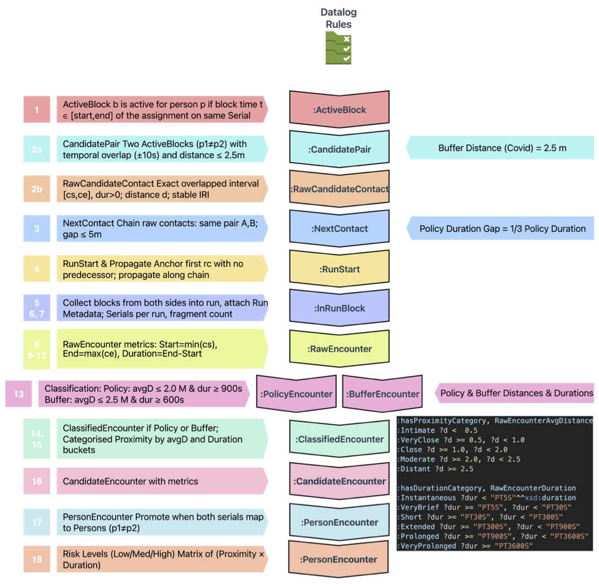

# Knowledge Representation for Infection Transmission Risk Prediction

This repository contains the intial pipeline for building an OWL Ontology / Knowledge Graph from a real-time data location system (RTLS) SQL Dataset. Ontop ODBA mappings and Datalog rules are used to generate categorical proximity and duration ranges for encounter events to provide inputs for downstream rule mining and Machine Learning.

The main components

# Ontology: OWL QL/RL Protégé compatible ontology

-	An extensible, reusable OWL ontology describing the domain and database schema to support the development of ML risk modelling.

# Mappings: Ontop ODBA mappings transfer SQL logic to RDF triple generation

-	ODBA / R2RML Mappings enabling SPARQL queries to be translated into SQL queries to the database.

# Datalog Rules

-	Definition of cascaded rules to determine if an encounter occurs.
-	Defined profiles for categories of proximity, duration to stratify risk.
-	Determine the limitations of rules structures to inform what is needed to identify a positive encounter.

